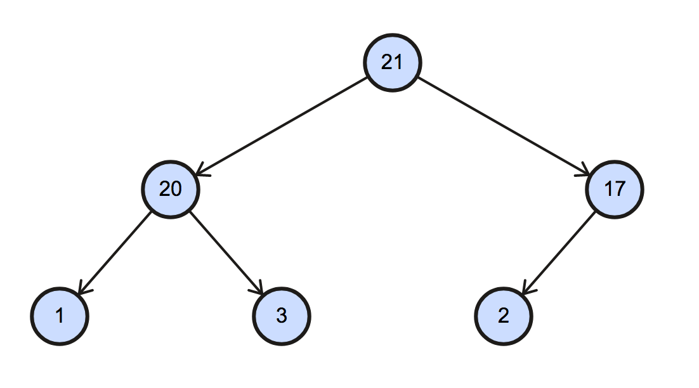

# Heapsort

[Heapsort（堆積排序法）][wiki-heapsort]可以看作是 [selection sort][wiki-selection-sort] 的變形，同樣會將資料分為 sorted pile 與 unsorted pile，並在 unsorted pile 中尋找最大／最小值，加入 sorted pile 中。

和 selection sort 不同之處是，heapsort 利用 [heap][wiki-heap] 這種半排序（partially sorted）的資料結構輔助並加速排序。

## Algorithm

Heapsort 的演算法分為兩大步驟：

1. 將資料轉換為 heap 資料結構（遞增用 max-heap, 遞減 min-heap）。
2. 逐步取出最大／最小值，並與最後一個元素置換。具體步驟如下：
  1. 交換 heap 的 root 與最後一個 node，縮小 heap 的範圍（排序一筆資料，故 -1）。
  2. 更新剩下的資料，使其滿足 heap 的特性。
  3. 重複前兩個步驟，直到 heap 中剩最後一個未排序的資料。

## Explanation

這裡有一個未排序的 array，將以遞增方向排序之。

```
[17, 20, 2, 1, 3, 21]
```

首先，將資料轉換為 heap 資料結構（**heapify**）。  
由於是遞增排序，我們採用 max-heap（最元素在 root）。

```
[21, 20, 17, 1, 3, 2]
```

對應的二元樹（binary tree）的圖形如下：



Max-heap 會將最大的元素擺在 root 的位置，我們先將最後一個 node 與 root 進行交換，完成第一個排序步驟。

```
[21, 20, 17, 1, 3, 2]
 *                 *
(swap) -->

        unsorted | sorted
[2, 20, 17, 1, 3 | 21]
```

接下來，將未排序的資料區塊重整為符合 max-heap 的結構。

> _sift down_ 是 heap 資料結構內部的演算法之一，可將 node 往下移。通常用在 heap 刪除或取代 node 時，將資料更新為有效的 heap。

```
[2, 20, 17, 1, 3 | 21]

(sift down) -->

[20, 3, 17, 1, 2 | 21]
```

有沒有看出一些端倪？  
只要不斷將 root 和最後個 node 交換，並將剩餘資料更新至滿足 heap 特性，就完成排序了。

```
[20, 3, 17, 1, 2 | 21]
 *             *
(swap) -->

[2, 3, 17, 1 | 20, 21]

(sift down)-->

[17, 3, 2, 1 | 20, 21]
 *         *  
(swap) -->

[1, 3, 2 | 17, 20, 21]

(sift down)-->

[3, 1, 2 | 17, 20, 21]
 *     *
(swap) -->

[1, 2 | 3, 17, 20, 21]

(Done!)
```

以上便是 heapsort 演算法的簡單流程，是不是和 selection sort 非常相似啊！


## Performance

|              | Complexity       |
| :----------- | :--------------- |
| Worst        | `O(nlogn)`       |
| Best         | `O(nlogn)`       |
| Average      | `O(nlogn)`       |
| Worst space  | `O(1)` auxiliary |

Heapsort 最佳、最差、平均的時間複雜度皆為 `O(nlogn)`，同樣分為兩部分簡單解釋。

**Build heap (heapify)**

這裡有個含有 `n` 個元素的 heap，和二元樹相同，其樹高為 `log(n)`。

**Sift down**

[wiki-heap]: https://en.wikipedia.org/wiki/Heap_(data_structure)
[wiki-heapsort]: https://en.wikipedia.org/wiki/Heapsort
[wiki-selection-sort]: https://en.wikipedia.org/wiki/Selection_sort
