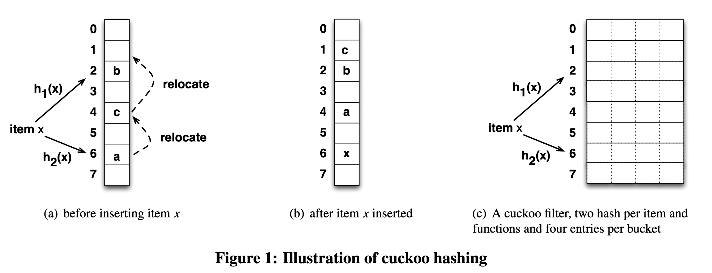

# 布隆過濾器 Bloom Filter

Bloom filter 是一種機率資料結構（probabilistic data structure），類似於[集合](../set)，常用於需快速驗證成員是否「可能存在」或是「絕對不存在」在容器中，亦即有機會出現假陽性（false positive），但絕不會有假陰性（false negative）。

Bloom filter 的優勢是：

- 類似[集合](../set)，可在 $O(1)$ 時間複雜度驗證成員是否存在，卻僅需相對少的儲存空間。
- 承上，[在 0.1% 錯誤率下儲存一百萬個元素僅需 1.71 MiB][bloom-filter-simulation]。
- 非常容易實作的機率資料結構，僅需多次雜湊。

Bloom filter 則有以下短處：

- 經典款 Bloom filter 容器大小固定（fixed-size），無法動態調整儲存空間。
- 可能給出假陽性答案：回報存在但實際不存在，且錯誤隨數量變多上升。
- 自身不儲存成員資料，需要有額外的儲存資料方案。
- 只能新增成員，但不能移除成員（可透過[變形](#變形)解決）。
- 若輸入資料集本身離散，接近[隨機存取][wiki-random-access]，無法充分利用 CPU cache。
- 承上，因為隨機存取，不利於延伸到記憶體以外的外部儲存裝置。

Bloom filter 常見應用場景為：

- [資料庫利用 Bloom filter](https://www.postgresql.org/docs/12/bloom.html) 中減少實際存取 disk 的 IO 開銷。
- Chromium 瀏覽器[驗證大量惡意連結](https://chromiumcodereview.appspot.com/10896048/)。
- Medium [避免推薦已推薦過的文章](https://blog.medium.com/what-are-bloom-filters-1ec2a50c68ff)。

> 小知識：bloom 是開花之意，但 Bloom filter 和開花沒任何關係，只因發明人姓氏為 Bloom

## 概念

Bloom filter 由下列兩個部分組成：

- 一個 $m$ 位元的位元陣列（bit array）
- $k$ 個不同的雜湊函數

經典款的 Bloom filter 作為一個近似集合的容器，提供下列兩個操作

- **新增：** 新增一個值時，透過 $k$ 個雜湊函數產生 $k$ 個雜湊值，分別代表在位元陣列的索引位置，再將 $k$ 個位置的位元翻轉至 1。
- **查詢：** 同樣透過 $k$ 個雜湊函數產生 $k$ 個雜湊值作為位元陣列的索引位置，若所有位元皆為 1，則代表該值存在。


> 上圖顯示 w 並沒有在 {x,y,z} 集合中，因為 w 的雜湊結果有個位元為 0。

你可能會開始想：

- 欲儲存一百萬個元素，需要多少位元？
- 出現假陽性的機率是多少？可以調整嗎？
- 需要幾個雜湊函數？
- 可重複使用相同的雜湊函數嗎？

回答這些問題需要兩個已知條件：

1. 預期會儲存多少 $n$ 個元素到容器。
2. 可容忍的假陽性機率 $\epsilon$，即容器不包含該元素，檢測卻回報存在（所有雜湊位皆為 1）。

於是可得位元陣列最佳化的長度為 $m$ 個位元，$m$ 為：

$$m = -\frac{n \ln{\epsilon}}{(\ln{2})^2}$$

而在已知條件下，需要的雜湊函數數量 $k$ 為：

$$k = -\frac{\ln{\epsilon}}{\ln{2}} = -\log_2{\epsilon}$$

當然，這些公式並非憑空冒出，有興趣可以讀讀[維基百科上的數學](https://en.wikipedia.org/wiki/Bloom_filter#Optimal_number_of_hash_functions)，和[這段詳細的推導](https://sagi.io/bloom-filters-for-the-perplexed/#false-positive-probability-and-formulae)，不過也要注意，Bloom filter 的假設是「每個雜湊函數獨立」但[位元間是否獨立有待討論](https://gopiandcode.uk/logs/log-bloomfilters-debunked.html#org7b3d391)，這順便開啟了其他問題，可重複使用相同的雜湊函數嗎？

答案是可以， 這篇[「Less Hashing, Same Performance:Building a Better Bloom Filter」][less-hashing-same-perf]提及，在不犧牲漸進假陽性機率（asymptotic false positive probability）的前提下，透過兩個不同的雜湊函數 $h_1(x)$ 和 $h_2(x)$，配合以下公式，就可以模擬出多個雜湊函數：

$$g_i(x) = h_1(x) + ih_2(x)$$

數學看暈了嗎？來點程式碼吧。

## 架構設計

### 利用 `Vec` 儲存位元

Bloom filter 底層以位元陣列作為儲存容器，如果目標是最省空間，該用 Rust 的什麼型別來儲存位元呢？

直觀作法是在 struct 新增一個 `bits` 位元陣列的 `array` 型別：

```rust
pub struct BloomFilter {
  bits: [bool; N]
}
```

雖然非常省空間，用了多少 bits 這個 struct 就佔多大，但這語法並非不合法，因為 `N` 未定義，無法編譯，[array](https://doc.rust-lang.org/std/primitive.array.html) 的 `N` 必須是編譯期就決定的常數，BloomFilter 若寫死 `N` 就不夠泛用了（除非參考 [`vec!`](https://doc.rust-lang.org/alloc/macro.vec.html) 透過 macro 建立）。

不如換個方向，不用 fixed size array，給定動態大小的 `slice` 試試看。

```rust
pub struct BloomFilter {
  bits: [bool]
}
```

嗯，可以編譯通過，但如果嘗試建立一個 struct 呢？

```rust
fn main() {
    let input_len = 5;
    let bits = [true; input_len];
    BloomFilter { bits };
}
```

就會發現編譯結果如下：

```bash
error[E0435]: attempt to use a non-constant value in a constant
 --> src/main.rs:7:23
  |
7 |     let bits = [true; input_len];
  |                       ^^^^^^^^^ non-constant value

error[E0277]: the size for values of type `[bool]` cannot be known at compilation time
 --> src/main.rs:8:5
  |
8 |     BloomFilter { bits };
  |     ^^^^^^^^^^^^^^^^^^^^ doesn't have a size known at compile-time
```

原因有二，其一同樣是 array `bits` 需要一個常數長度；其二則是 `bits` 是一個 [Dynamic Sized Types（Dsts）][rust-dst] ，長度無法在編譯時決定，編譯期就無法得知 BloomFilter 的所佔記憶體用量。

看來得放棄用 `array` 或 `slice` 這些方法，改用最暴力的 `Vec` 作為位元陣列儲存容器，`Vec` 雖可動態調整大小，背後其實是一個 pointer + 一個 `usize` 的 `capacity` + 一個 `usize` 的 `len` 組成，若是在 64 位元的機器上，[一個 `Vec` 就會佔 24 位元組](https://cheats.rs/#general-purpose-heap-storage)，比起 `array` 多耗費兩個 2 * 8 個位元組空間，幸好這額外的 16 個位元組是固定支出，不隨著 $m$ 和 $n$ 成長。

```rust
pub struct BloomFilter {
  bits: Vec<bool>
}
```

### 儲存兩個雜湊函數

再來，要在 `BloomFilter` 儲存兩個 hasher，也就是實作前面提及[用兩個雜湊函數模擬 $k$ 個][less-hashing-same-perf]論文中的兩個 hasher，這兩個在 `BloomFilter` 建構時同時建立，並在操作 `BloomFilter` 的方法上共用。

這次直接使用標準函式庫內預設雜湊演算法 [`DefaultHasher`](http://doc.rust-lang.org/std/collections/hash_map/struct.DefaultHasher.html) 作為隨機的兩個雜湊函數 `BloomFilter.hashers`。由於是模擬 $k$ 個函數的雜湊行為，仍需另闢欄位，儲存 $k$ 實際上是多少個雜湊函數 `BloomFilter.hash_fn_count`。

```rust
use std::collections::hash_map::DefaultHasher;

pub struct BloomFilter {
  /// The bit array of _m_ bits.
  bits: Vec<bool>,
  /// Count of hash functions. Denoted by _k_.
  hash_fn_count: usize,
  /// The hashers that do real works.
  hashers: [DefaultHasher; 2],
}
```

就剩最後一里路了！

### 使用 [`PhantomData`][rust-std-marker-PhantomData] 讓編譯器閉嘴

眾所周知，透過[泛型（Generic）][rust-generic]，Rust 可重用相同的容器型別，特化接受不同型別的容器，例如 `HashMap<K, V>` 可以特化為鍵為 `String`，值為 `u32` 的 `HashMap<String, u32>`，`Vec<T>` 可以成為二維位元組 `Vec<Vec<u8>>`。看 [`std::collections`][rust-std-collections] 提供的容器，所有泛型型別參數（Type Parameter）像是 `T`、`K`、`V` 都是跟著 struct 宣告，也因為這些容器的確實際儲存了這些型別的元素，泛型型別參數跟著 struct 很合理。

有趣的是，作為一個容器，Bloom filter 其實不儲存元素本身，而是記錄元素是否「曾經新增至」該容器中。這給了一些想像空間：如何提供型別參數給 Bloom filter？提供兩個方向：

1. **泛型型別參數宣告跟著 struct：** 也就是 `struct BloomFilter<T>`，如此一來，一個容器實例只能操作一種型別，而且在編譯期就決定。
    ```rust
    let bf = BloomFilter::new();
    bf.insert(&1);            // infer the type T is i32
    bf.insert("wront type");  // compile error: &str is not compatible to i32
    ```
2. **泛型型別跟著 struct 的方法，struct 本身不宣告：** 很難想像容器裡面儲存不同的型別，但 BloomFilter 實際上只需要一個 `Vec<bool>` 記錄存在與否，到底新增了什麼型別的元素其實不重要，型別有實作雜湊就行。這個作法下，你可能會看到這種邪魔歪道：
    ```rust
    let bf = BloomFilter::new();
    bf.insert(&1);
    bf.insert("another type");  // it works
    bf.insert(vec![3.14159]);   // it also works
    ````

為了讓容器有一致感，這裡決定選擇法一，讓泛型跟著容器走。實作非常簡單，加上 `T` 泛型參數就行

```diff
use std::collections::hash_map::DefaultHasher;

- pub struct BloomFilter {
+ pub struct BloomFilter<T> {
  /// .. snip
}
```

哎呀，編譯失敗！

```bash
error[E0392]: parameter `T` is never used
 --> src/lib.rs:3:24
  |
3 | pub struct BloomFilter<T> {
  |                        ^ unused parameter
  |
  = help: consider removing `T`, referring to it in a field, or using a marker such as `std::marker::PhantomData`
```

因為 Rust 編譯器認為 `BloomFilter` 並不實際擁有 `T` 相關欄位，因此編譯不通過，我們可以利用 [`std::marker::PhantomData`][rust-std-marker-PhantomData]，`PhantomData` 是一個 Zero-Sized Type 不佔空間，就是為了取悅編譯器，製造出 struct 擁有 `T` 的假象。

```rust
use std::collections::hash_map::DefaultHasher;
use std::marker::PhantomData;

pub struct BloomFilter<T> {
  /// The bit array of _m_ bits.
  bits: Vec<bool>,
  /// Count of hash functions. Denoted by _k_.
  hash_fn_count: usize,
  /// The hashers that do real works.
  hashers: [DefaultHasher; 2],
  _phantom: PhantomData<T>,
}
```

## `?Sized` 讓容器可以儲存 DSTs

最後，有鑑於讓Bloom fliter 能夠接受更多型別，元素不一定要符合編譯期確定大小的 [`Sized`][rust-std-marker-Sized] trait bound，可以透過加上 `?Sized` trait bound 解除預設的限制，如此一來 `BloomFilter` 就可接受 slice 和 trait object 這些 [DSTs][rust-dst] 了，傳入 string literal 變為可能 `bloom_filter.insert("1234")`。

```diff
use std::collections::hash_map::DefaultHasher;
use std::marker::PhantomData;

- pub struct BloomFilter<T> {
+ pub struct BloomFilter<T: ?Sized> {
    // .. snip
}
```

[rust-dst]: https://doc.rust-lang.org/book/ch19-04-advanced-types.html#dynamically-sized-types-and-the-sized-trait
[rust-std-marker-PhantomData]: https://doc.rust-lang.org/core/marker/struct.PhantomData.html
[rust-generic]: https://doc.rust-lang.org/book/ch10-01-syntax.html
[rust-std-collections]: http://doc.rust-lang.org/std/collections/index.html
[rust-std-marker-Sized]: http://doc.rust-lang.org/std/marker/trait.Sized.html
[rust-ref-?Sized]: https://doc.rust-lang.org/reference/trait-bounds.html#sized

## 基本操作

Bloom filter 為類似集合的容器，當然有[類似的操作](../set#基本操作)，事實上，這類機率性集合成員檢測的資料結構有個較少聽見但令人印象深刻的名字，稱為「Approximate Membership Query（AMQ）」，提供 `add(element)` 和 `query(element)` 兩個基本操作。

本文的 `BloomFilter` 提供下列幾個公開方法：

- `new`：初始化一個容器。
- `insert`：新增一個元素。
- `contains`：檢查容器內有無特定元素（是否曾新增過）。

以及幾個內部輔助方法：

- `make_hash`：給定輸入元素資料，透過兩個雜湊函數產生兩個雜湊值。
- `get_index`：將 `make_hash` 的兩雜湊值帶入 $g_i(x) = h_1(x) + ih_2(x)$ 計算單次 `i` 的索引位置。
- `optimal_bits_count`：給定預期儲存元素個數 $n$ 與假陽性機率 $\epsilon$，得位元陣列最適位元數 $m$。
- `optimal_hashers_count`：給定預期假陽性機率，得最適雜湊函數個數 $k$。

### 初始化

Bloom filter 有四個參數 $m$、$n$、$k$、$\epsilon$ 可以調整（詳見 [效能](#效能)一節），對使用者來說，有幾個雜湊函數或底層是多少個位元都是實作細節了，更關心的可能是

_「我有一百萬筆資料需要驗證存在，容錯率需要在 0.1%，我需要多大的儲存空間？」_

因此，建構函數 `new` 提供輸入預期儲存元素個數 $n$ 和預期的假陽性機率 $\epsilon$ 是天經地義的事：

```rust
pub fn new(capacity: usize, err_rate: f64) -> Self;
```

接下來，會實作[概念](#概念)一節的數學公式，找出最適位元數和最適雜湊函數個數。這兩個函數都是以 Rust 表達數學公式，可注意的點是，[`std::f32::consts`][rust-std-f32-consts] 和 [`std::f64::consts`][rust-std-f64-consts]，提供許多數學上常見的常數老朋友，操作浮點數和雙精度浮點數就不用自己手動重算了。

```rust
/// m = -1 * (n * ln ε) / (ln 2)^2
fn optimal_bits_count(capacity: usize, err_rate: f64) -> usize {
    let ln_2_2 = std::f64::consts::LN_2.powf(2f64);
    (-1f64 * capacity as f64 * err_rate.ln() / ln_2_2).ceil() as usize
}

/// k = -log_2 ε
fn optimal_hashers_count(err_rate: f64) -> usize {
    (-1f64 * err_rate.log2()).ceil() as usize
}
```

目前為止，`BloomFilter::new` 長這樣：

```rust
pub fn new(capacity: usize, err_rate: f64) -> Self {
    let bits_count = Self::optimal_bits_count(capacity, err_rate);
    let hash_fn_count = Self::optimal_hashers_count(err_rate);
}
```

最後，按照前述[兩個雜湊函數恰恰好][less-hashing-same-perf]的道理，建立兩個不同的雜湊函數，並初始化位元陣列，大功告成！

```rust
pub fn new(capacity: usize, err_rate: f64) -> Self {
    // #1 Get optimal count of bit
    let bits_count = Self::optimal_bits_count(capacity, err_rate);
    // #2 Get optimal count of hash functions
    let hash_fn_count = Self::optimal_hashers_count(err_rate);
    // #3 Use RandomState to build different hasher
    let hashers = [
        RandomState::new().build_hasher(),
        RandomState::new().build_hasher(),
    ];

    Self {
        bits: vec![false; bits_count], // #4 Initialize a all zero bit array
        hash_fn_count,
        hashers,
        _phantom: PhantomData,
    }
}
```

1. 透過指定假陽性機率與預期元素個數，算得最適位元數
2. 透過指定假陽性機率，算得最適雜湊函數個數
3. 透過 std 內建的 [`RandomState`][rust-std-RandomState] 產生兩個不同初始狀態的雜湊函數，以模擬 $k$ 個雜湊函數
4. 初始化一個全零的位元陣列

[rust-std-f32-consts]: http://doc.rust-lang.org/std/f32/consts/index.html
[rust-std-f64-consts]: http://doc.rust-lang.org/std/f64/consts/index.html
[rust-std-RandomState]: http://doc.rust-lang.org/std/collections/hash_map/struct.RandomState.html

### 新增

新增一個元素到 Bloom filter，說穿了就做一件事：將元素透過 $k$ 個雜湊函數，產出 $k$ 個索引位置，並將位元陣列上這些位置的位元翻轉至 1。

整個 `insert` 函數即為計算 $g_i(x) = h_1(x) + ih_2(x)$ 模擬 $k$ 個雜湊函數的過程：

```rust
pub fn insert(&mut self, elem: &T)
where
    T: Hash,
{
    let hashes = self.make_hash(elem);  // #1
    for fn_i in 0..self.hash_fn_count { // #2
        let index = self.get_index(hashes, fn_i as u64); // #3
        self.bits[index] = true;        // #4
    }
}
```

1. 取得 $h_1(x)$ 和 $h_2(x)$ 的雜湊輸出結果。
2. 迭代 `i` 次，`i` 上限為 $k$：初始化時所得的最適雜湊函數個數
3. 計算 $g_i(x) = h_1(x) + ih_2(x)$ 取得索引位置
4. 將索引位置下的位元設定為 1

這裡有兩個內部方法，先講解如何計算 $h_1(x)$ 和 $h_2(x)$：

```rust
fn make_hash(&self, elem: &T) -> (u64, u64)
where
    T: Hash,
{
    // #1
    let hasher1 = &mut self.hashers[0].clone();
    let hasher2 = &mut self.hashers[1].clone();

    // #2
    elem.hash(hasher1);
    elem.hash(hasher2);

    // #3
    (hasher1.finish(), hasher2.finish())
}
```

1. 為保存兩個 hasher 內部初始狀態，使用 `clone` 複製新的 hasher 來做雜湊
2. 將 `elem` 餵給 hasher 計算雜湊值
3. 輸出雜湊值，由於 [`Hasher::finish`][rust-std-hasher-finish] 不會重設 hasher 內部狀態，所以需要步驟一 `clone` 來保留 hasher 的原始狀態

再來是實作計算索引位置 $g_i(x) = h_1(x) + ih_2(x)$，這個函數非常單純，就是輸入 `make_hash` 所得之雜湊值，然後帶入公式中。為了防止輸出的索引位置超過位元陣列的位元數，這裡以位元數 $m$ 取模（`%` modulo），加上使用 `wrapping_ops` 這些 modular arithmetic operation 達成。

```rust
fn get_index(&self, (h1, h2): (u64, u64), fn_i: u64) -> usize {
    (h1.wrapping_add(fn_i.wrapping_mul(h2)) % self.bits.len() as u64) as usize
}
```

[rust-std-hasher-finish]: http://doc.rust-lang.org/core/hash/trait.Hasher.html#tymethod.finish

### 查詢

查詢元素是否在 Bloom filter 裡面，就是看看該元素透過 $k$ 個雜湊函數輸出的每個索引位置**全部為 1**，則可能存在；否則就是絕對不存在。

實作步驟和插入非常相似：

```rust
pub fn contains(&self, elem: &T) -> bool
where
    T: Hash,
{
    let hashes = self.make_hash(elem); // #1
    (0..self.hash_fn_count).all(|fn_i| { // #1 使用 iter
        let index = self.get_index(hashes, fn_i as u64);
        self.bits[index]
    })
}
```

1. 取得 $h_1(x)$ 和 $h_2(x)$ 的雜湊輸出結果。
2. 使用 [Iterator::all][rust-core-iterator-all] 迭代收集 $k$ 個雜湊函數的輸出
3. 計算 $g_i(x) = h_1(x) + ih_2(x)$ 取得索引位置
4. 回傳索引位置下的位元 `bool` 值，此值會匯集起來，於步驟二確認命中全部 $k$ 個索引，即為元素存在

[rust-core-iterator-all]: http://doc.rust-lang.org/1.45.2/core/iter/trait.Iterator.html#method.all

完整程式碼如下，或轉駕到 [API 文件](/doc/rust_algorithm_club/collections/struct.BloomFilter.html)：

```rust
pub struct BloomFilter<T: ?Sized> {
    bits: Vec<bool>,
    hash_fn_count: usize,
    hashers: [DefaultHasher; 2],
    _phantom: PhantomData<T>,
}

impl<T: ?Sized> BloomFilter<T> {
    pub fn new(capacity: usize, err_rate: f64) -> Self {
        let bits_count = Self::optimal_bits_count(capacity, err_rate);
        let hash_fn_count = Self::optimal_hashers_count(err_rate);
        let hashers = [
            RandomState::new().build_hasher(),
            RandomState::new().build_hasher(),
        ];

        Self {
            bits: vec![false; bits_count],
            hash_fn_count,
            hashers,
            _phantom: PhantomData,
        }
    }

    pub fn insert(&mut self, elem: &T)
    where
        T: Hash,
    {
        // g_i(x) = h1(x) + i * h2(x)
        let hashes = self.make_hash(elem);
        for fn_i in 0..self.hash_fn_count {
            let index = self.get_index(hashes, fn_i as u64);
            self.bits[index] = true;
        }
    }

    pub fn contains(&self, elem: &T) -> bool
    where
        T: Hash,
    {
        let hashes = self.make_hash(elem);
        (0..self.hash_fn_count).all(|fn_i| {
            let index = self.get_index(hashes, fn_i as u64);
            self.bits[index]
        })
    }

    fn get_index(&self, (h1, h2): (u64, u64), fn_i: u64) -> usize {
        (h1.wrapping_add(fn_i.wrapping_mul(h2)) % self.bits.len() as u64) as usize
    }

    fn make_hash(&self, elem: &T) -> (u64, u64)
    where
        T: Hash,
    {
        let hasher1 = &mut self.hashers[0].clone();
        let hasher2 = &mut self.hashers[1].clone();

        elem.hash(hasher1);
        elem.hash(hasher2);

        (hasher1.finish(), hasher2.finish())
    }

    /// m = -1 * (n * ln ε) / (ln 2)^2
    fn optimal_bits_count(capacity: usize, err_rate: f64) -> usize {
        let ln_2_2 = std::f64::consts::LN_2.powf(2f64);
        (-1f64 * capacity as f64 * err_rate.ln() / ln_2_2).ceil() as usize
    }

    /// k = -log_2 ε
    fn optimal_hashers_count(err_rate: f64) -> usize {
        (-1f64 * err_rate.log2()).ceil() as usize
    }
}
```

## 效能

| Notation   | Description                   |
| ---------- | ----------------------------- |
| $n$        | 預期儲存 $n$ 個元素到容器中   |
| $m$        | 使用 $m$ 位元的位元陣列來儲存 |
| $k$        | 有 $k$ 個雜湊函數計算索引位置 |
| $\epsilon$ | 假陽性錯誤的機率 $\epsilon$   |

和常見的容器資料結構不太一樣，複雜度和 $n$ 元素個數脫鉤，而是和 $k$ 和 $m$ 相關：

| Operation   | Time complexity |
| ----------- | --------------- |
| insert(v)   | $O(k)$          |
| contains(v) | $O(k)$          |

而儲存空間複雜度則是 $O(m)$。

新增和搜尋一個元素個別需要雜湊 $k$ 次，因此時間複雜度為 $O(k)$ 顯而易見，然而，$k$ 通常相對 $m$ $n$ 是非常小的數字，例如
[在 0.1% 錯誤率下儲存一百萬個元素僅需 1.71 MiB 和 7 個雜湊函數][bloom-filter-simulation]，實務上直接當作 $O(1)$ 也不算錯。

至於空間複雜度，由於必須事先配置好 $m$ 位元的位元陣列，就算新增的元素 $n \gt m$，也不會再新增新位元，因此空間使用為 $O(m)$ 個位元。實務上，當 $n$ 成長到接近 $m$ 時，假陽性的機率會大增，不堪使用，進而需要能動態調整儲存空間的 Bloom filter 變形。

## 變形

經典款 Bloom filter 容易實作，歷久不衰，不過仍有許多可以增進空間：

- Data locality 不夠好：Bloom filter 底層儲存是位元陣列[隨機存取][wiki-random-access]，較不符合現代 CPU 架構的 cache line 使用姿勢。Cloudflare 技術部落格文 [When Bloom filters don't bloom](https://blog.cloudflare.com/when-bloom-filters-dont-bloom/) 以幽默筆法帶出這個問題，值得一讀。
- 雜湊次數過多：Bloom filter 每一個新增查詢操作都需要雜湊 $k$ 次，就算利用 double hashing 還是要雜湊兩次，比起其他類似資料結構硬生生多雜湊數次。
- 位元陣列大小固定：Bloom filter 容器大小固定，給你預期的元素個數後，無法動態調整儲存空間，
- bits per entry 較高：以類似功能的的資料結構來說，Bloom filter 在空間利用率上，欲維持一定的假陽性機率，每個元素所需位元數相對較高，需要 $1.44 \log_2{\frac{1}{\epsilon}}$ 個位元。

這裡介紹幾款嘗試解決上述問題的 filter，您也可以去 [Wikipedia 看看其他更多變形的介紹](https://en.wikipedia.org/wiki/Bloom_filter#Extensions_and_applications)。

### 可以計數的 Counting Bloom filter

[📚 維基百科](https://en.wikipedia.org/wiki/Counting_Bloom_filter)

經典款 Bloom filter 之所以無法刪除元素，是因為沒有記錄哪些元素新增/刪除的資訊，而 Counting Bloom filter 顧名思義，原本用一個位元儲存 0 / 1 資訊，延伸為多位元方便儲存計數（counting），有了個別元素增刪資訊，Bloom filter 因此能實作「刪除元素」。搜尋一個 Counting Bloom filter 是否擁有 n 次以上 x，答案一樣和 Bloom filter 類似是「可能有 n 次以上的 x」或是「x 絕對沒有 n 次以上」。事實上，可將 Counting Bloom filter 視為 Bloom filter 的一般化形式（generalized form），而經典款 Bloom filter 反過來可當作只記一次數的特化。

但 Counting Bloom filter 的缺點是空間需求大，端看決定要用幾個位元計數，例如常見用 4 個位元計數，則是經典款的四倍空間消耗。

### 動態適應空間大小的 Scalable Bloom Filter

[📚 論文連結](https://gsd.di.uminho.pt/members/cbm/ps/dbloom.pdf)

Scalable Bloom Filter 的特色是：動態適應空間大小，不需事先知道預期儲存的元素個數。

Scalable Bloom Filter 的實作蠻暴力的，本身是由一至多個經典款 Bloom filter 組成，若一個 filter 滿了（超過 fill ratio），則會新增一個 filter，往後所有新增都在這個新 filter 上面，直到它也滿了，可視為一個 recursive data structure。

至於查詢，這就是 Scalable Bloom Filter 比較弱的地方，查詢會從第一個 filter 開始找，若找不到往下一個 filter 找，找到會沒有下一個 filter 為止。若 filter 數量為 $l$，則查詢的時間複雜度從 $O(k)$ 變成 $O(k \cdot l)$。

除了初始化大小和假陽性機率率，Scalable Bloom Filter 提供設定成長率和假陽性錯誤緊縮率：

- 成長因子 $s$：每個新增的 filter 空間大小成長率，論文的經驗法則得出預期小成長趨勢選擇 $s = 2$，有較大成長趨勢則 $s = 4$ 效果好。
- 錯誤緊縮率 $r$： 每個新增的 filter 會以等比級數得到更緊縮的假陽性機率上限，由於是等比級數，逼近極限時會小於原始機率，這讓整體假陽性機率得以保持。論文中實證 0.8 到 0.9 在元素預期有大成長率下有最佳平均空間利用率。

### Quotient filter

[📚 論文連結][paper-quotient-filter]（直接讀論文更易懂）

商數過濾器（Quotient filterF）利用[雜湊表](../hash_map)為底層儲存容器，來做集合成員檢測的 AMQ，為了節省空間使用量，Quotient filter 的雜湊表只儲存 partial-key，俗稱指紋（fingerprint），指紋的鍵短空間用量低，副作用是更容易碰撞，代表需要更有效處理雜湊碰撞（hash collision）。

一般來說，[處理雜湊碰撞](../hash_map#處理雜湊碰撞)有 separate chaining 和 Open addressping 兩大類方法，而 Quotient filter 選擇了另一條詭譎的方法：利用 open addressing 中 linear probing 的方式，對每個 slot 儲存額外資訊，使得我們可辨認碰撞的元素是在相同指紋下的同個 bucket 內。換句話說，額外資訊就是在「透過 linear probing 模擬 separate chaining」。

回到指紋，Quotient filter 實際上並不直接儲存指紋，而是將指紋 $f$ 進一步拆成商 $f_q$ 與餘數 $f_r$，商作為索引位置，而餘數則為真實被儲存的值。透過商和餘數，可重組回推原本的指紋。不需存完整的指紋，又再次減少空間使用量，帥！

簡單總結 Quotient filter 的特性：

- 使用 linear probing 解決雜湊碰撞，data locality 好，有 cache friendly。
- 有額外儲存資訊，可在不重建不 rehash filter 的情況下支援刪除、合併、調整空間。
- 綜合上述兩點，非常適合 LSM-tree 等需要存取 SSD 的場景，大幅減少 I/O。
- Throughput 受到雜湊表 load factor 影響較大。
- 空間用量仍比經典款 Bloom filter 多 10% 到 25%。


> Quotient filter 與它等價的 open addressing hash map

_Image Source: [Bender, et al., 2012. "Don’t Thrash: How to Cache Your Hash on Flash"][paper-quotient-filter]._

[paper-quotient-filter]: http://vldb.org/pvldb/vol5/p1627_michaelabender_vldb2012.pdf

### 支援刪除元素的 Cuckoo filter

[📚 論文連結][paper-cuckoo-filter]（有趣易讀，誠摯推薦）

Cuckoo hashing 是一種解決雜湊碰撞的方法，透過一次計算兩個雜湊函數產生兩個索引位置，若其中一個位置有空位則插入空位，若都沒有空位，則隨機踢掉一個，被踢掉的再去找下一個替死鬼，直到全部都有位置，或踢掉次數大於一定值則停止。這種行為和杜鵑鳥（cuckoo、布穀鳥）鳩佔鵲巢的生物習性很像，因此得名。

Cuckoo filter 利用[雜湊表](./hash_map)為底層儲存容器，來做集合成員檢測的 AMQ，會和 cuckoo 扯上關係則是因為使用 Cuckoo hashing 解決雜湊碰撞，以增加空間使用率（達到 95% occupancy）。Cuckoo filter 的雜湊表和 Quotient filter 一樣，為了減少空間使用量而只儲存 partial-key。

儲存指紋導致鍵變短，容易碰撞，也代表萬一碰撞，沒辦法透過原始的鍵再次雜湊來找到 Cuckoo hasing 對應另一位置，不過 Cuckoo filter 巧妙利用 XOR 的 identity $x \oplus x = 0$ 解決問題，double hashing 公式奉上：

$$
h_1(x) = hash(x) \\\\ 
h_2(x) = h_1(x) \oplus hash(fingerprint(x))
$$

如此一次，透過 $h_2(x)$ 和指紋的 XOR 就可以得到 $h_1(x)$，公式進而可一般化成：

$$j = i \oplus hash(fingerprint(x))$$

其中 $j$ 與 $i$ 為同個元素經過兩個雜湊函數中任一的值，神奇吧！

Cuckoo filter 的特性是：

- 支援動態新增與刪除元數。
- 比其他 filter 變形（例如 Quotient filter）好實作，如果懂 Cuckoo hashing 的話。
- 查詢效能比經典款 Bloom filter 好，bits per item 也比較低（$(\log_2{\frac{1}{\epsilon}} + 2) / \alpha$，$\alpha$ 是雜湊表的 load factor，通常為 95.5%）。
- 缺點是「一定要先新增過一個元素，才能對 filter 刪除該元素」，但這是所有支援刪除的 filter 的通病，不然就會有假陽性發生。



_Image Source: [Fan, et al., 2014. "Cuckoo Filter: Practically Better Than Bloom"][paper-cuckoo-filter]._

[paper-cuckoo-filter]: https://www.cs.cmu.edu/~dga/papers/cuckoo-conext2014.pdf

## 參考資料

- [Burton H. Bloom: Space/Time Trade-offs in Hash Coding with Allowable Errors](https://citeseerx.ist.psu.edu/viewdoc/download;?doi=10.1.1.641.9096&rep=rep1&type=pdf)
- [Wiki: Bloom filter](https://en.wikipedia.org/wiki/Bloom_filter)
- [Less Hashing, Same Performance:Building a Better Bloom Filter](https://www.eecs.harvard.edu/~michaelm/postscripts/rsa2008.pdf)
- [Onat: Let's implement a Bloom Filter](https://onatm.dev/2020/08/10/let-s-implement-a-bloom-filter/)
- [Google Guava: BloomFilter](https://github.com/google/guava/blob/v29.0/guava/src/com/google/common/hash/BloomFilter.java)
- [Bloom Filter Calculator](https://hur.st/bloomfilter/)

[less-hashing-same-perf]: https://www.eecs.harvard.edu/~michaelm/postscripts/rsa2008.pdf
[bloom-filter-simulation]: https://hur.st/bloomfilter/?n=1M&p=0.001&m=&k=
[wiki-random-access]: https://en.wikipedia.org/wiki/Random_access
