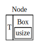

# 單向鏈結串列 Singly linked list

單向鏈結串列是鏈結串列家族中最簡單的版本，特色是每兩個節點間只有一個單向的鏈結。

```
   head
    |
    v
+--------+   +--------+   +--------+
|        |   |        |   |        |
| node 0 |-->| node 1 |-->| node 2 |--> NULL
|        |   |        |   |        |
+--------+   +--------+   +--------+
```

## 架構設計

### Node

先建立最基本的節點 Node。

```rust
// cannot compile
struct Node<T> {
    elem: T,
    next: Node<T>,
}
```

`Node.elem` 很直觀地儲存實際資料。而 `Node.next` 則是指向下個 Node。但這樣編譯不會成功，Rust 編譯時需要決定每個型別該配置多少記憶體空間，這種遞迴型別使得編譯器無限循環，無法決定配置大小。


很簡單，我們使用 [`Box<T>`][rust-box] 這個智慧指標，直接將 Node 配置在記憶體 heap 上。如此以來，編譯器就會知道 `next` 只佔了一個指標的空間。

```rust
struct Node<T> {
    elem: T,
    next: Box<Node<T>>,
}
```



由於 Rust 沒有 null pointer，但照鏈結串列的定義，`Node.next` 可以是 NULL，因此我們使用 [`Option<T>`][rust-option] 模擬 null pointer 的行為。最後，Node 的定義如下：

```rust
struct Node<T> {
    elem: T,
    next: Option<Box<Node<T>>>,
}
```

[rust-box]: https://doc.rust-lang.org/std/boxed/index.html
[rust-option]: https://doc.rust-lang.org/std/option/index.html

### SinglyLinkedList

在開始實作各種增刪節點的操作之前，我們需要建立一個 struct 存放指向鏈結串列 head 的指標，同時，各種操作也會實作在這個 struct 上。事實上，這個 struct 就是對外公開的資料結構。

```rust
pub struct SinglyLinkedList<T> {
    head: Option<Box<Node<T>>>,
}
```

選擇把操作串列的函式寫在另一個 struct 而非 Node 上有幾個原因，1）外部並不需知道串列內部如何實作，公開 Node 會暴露實作。2）每個 Node 都帶有成員函式的話，函式指標會佔用太多額外資源。

## 基本操作

串列的基本操作如下：

- `new`：初始化一個空串列。
- `push_front`：新增節點到開頭的位置。
- `pop_front`：將開頭第一個節點移除。
- `insert_after`：在指定索引位置後插入一個新節點。
- `remove`：移除任意索引下的節點。
- `clear`：清除所有節點。
- `is_empty`：檢查串列是否沒有任何節點。
- `reverse`：反轉整個串列（head 變成 tail）。

### 初始化與清除資料

實做初始化與清除資料非常直觀。其中清除其實就只是將 `self` 指向新的串列實例。

```rust
impl<T> SinglyLinkedList<T> {
    pub fn new() -> Self {
        Self { head: None }
    }

    pub fn clear(&mut self) {
        *self = Self::new();
    }
}
```

你可能會想，在清除所有資料時，資源需不需要手動釋放？

和 C++ 的 RAII 一樣，Rust 有一個名叫 `drop` 的解構式，只要程式執行離開了資源擁有者的可視範圍（out of scope），就會自動呼叫 `drop`。我們在 [Drop trait](#drop-trait) 一節會再深入探討。

### 增刪首個節點

單向鏈結串列在第一個節點前增加新節點，或是刪除第一個節點，都可以在常數時間完成。新增節點 `push_front` 的概念很簡單，1）建立新的節點，並把新節點 `next` 指標指向串列第一個節點。2）把串列的 head 指向新建立的節點。

```rust
pub fn push_front(&mut self, elem: T) {
    let next = self.head.take(); // 1
    self.head = Some(Box::new(Node { elem, next })); // 2
}
```

1. 釋放 SinglyLinkedList 對第一個節點的所有權
2. 建立一新節點，並將原本第一個節點所有權轉移給新節點。再將新節點所有權轉移到串列本身。

刪除第一個節點 `pop_front` 的實作步驟如下：首先取得第一個節點的所有權，再將 head 指向第一個節點 `Node.next` 下一個節點，再返回第一個節點的資料給呼叫端。

```rust
pub fn pop_front(&mut self) -> Option<T> {
    let head = self.head.take(); // 1
    match head {
        Some(node) => {
            self.head = node.next;  // 2
            Some(node.elem)         // 3
        }
        None => None,
    }
}
```

1. 取得第一個元素的所有權。
2. 將 head 指向下一個節點。
3. 返回即將刪除節點的資料。

### 插入刪除任意節點

鏈結串列新增和刪除第一個節點都可以在 $O(1)$ 時間內做完，那為什麼插入刪除任意節點沒有辦法呢？原因是鏈結串列不支援隨機存取（random access），就是無法透過索引在常數時間內取得資料，每次的搜尋都只能從 head 開始。因此，當我們需要在某個索引的節點後新增一筆資料，我們會需要最差 $O(n)$ 的複雜度。

實作插入 `insert_after` 分為幾個步驟：

```rust
pub fn insert_after(&mut self, pos: usize, elem: T) -> Result<(), usize> {
    let mut curr = &mut self.head;
    let mut pos_ = pos;

    while pos_ > 0 {                        // 1
        curr = match curr.as_mut() {
            Some(node) => &mut node.next,
            None => return Err(pos - pos_),
        };
        pos_ -= 1;
    }

    match curr.take() {                     // 2
        Some(mut node) => {   // Node A
            let new_node = Box::new(Node {  // 3: Node B
                elem,
                next: node.next,
            });
            node.next = Some(new_node);     // 4
            *curr = Some(node);             // 5
        }
        None => return Err(pos - pos_)
    }
    Ok(())
}
```

1. 找到對應索引值的節點 A，若找不到則回傳這個串列的資料長度。
2. 先取得節點 A 的所有權，才能修改它的值。
3. 建立新節點 B，同時將節點 B 的 `next` 指向 A 的後一個節點。
4. 將新節點 B 做為節點 A 後一個節點 `next`。
5. 把修改過的節點 A，重新賦值給指向節點 A 的指標 `curr`（可視為歸還所有權）。

而實作刪除任意索引下的節點 `remove` 和插入非常相似。

```rust
pub fn remove(&mut self, pos: usize) -> Option<T> {
    let mut curr = &mut self.head;
    let mut pos = pos;

    while pos > 0 {                // 1
        curr = match curr.as_mut() {
            Some(node) => &mut node.next,
            None => return None,
        };
        pos -= 1;
    }

    match curr.take() {            // 2
        Some(node) => { // Node A
            *curr = node.next;     // 3: node.next is Node B
            Some(node.elem)        // 4
        }
        None => None
    }
}
```

1. 找到對應索引值的節點 A，若找不到則回傳 `None`。
2. 先取得節點 A 的所有權，才能修改它的值。
3. 把節點 A 的後一個節點 B 賦值給原本指向節點 A 的指標 `curr`。
4. 回傳節點 A 的值。

### 反轉

反轉鏈結串列是工作面試時很常見的考題，這裡來實作看看。

```rust
pub fn reverse(&mut self) {
    let mut prev = None;              // 1: prev -> Node P
    let mut curr = self.head.take();  // 2
    while let Some(mut node) = curr { // 3: node -> Node A
        let next = node.next;         // 3-1: next -> Node B
        node.next = prev.take();      // 3-2
        prev = Some(node);            // 3-3
        curr = next;                  // 3-4
    }
    self.head = prev.take(); // 4
}
```

1. 先建立一個暫時變數 `prev`，儲存迭代時的前一個節點。
2. 從串列 head 取得第一個節點的所有權。
3. 依序迭代整個串列
    1. 將節點 A 的後一個節點 B 暫存起來。
    2. 節點 A 的 `next` 指向暫存在變數 `prev` 的節點 P。
    3. 節點 A 暫存在變數 `prev` 內，保留到下一個迭代使用。
    4. 將節點 B 儲存在變數 `curr` 內。此時  
       `prev`：節點 A，A 的 `next` 指向 P，  
       `curr`：節點 B，B 的 `next` 指向 A。
4. 最後一次迭代時，變數 `prev` 會儲存原始串列末端節點，這時轉移所有權到 head，完成反轉。

## Traits

除了基本操作，`SinglyLinkedList` 實作了許多 trait，使用上更方便更符合 Rust 的慣例。

### Drop trait

如果一個 struct 有許多成員，則會遞迴呼叫 struct 的 `drop` 成員函式。因此，一個串列的解構式很可能發生深層的巢狀遞迴：

```
# a linked list
a -> b -> c -> x -> y -> z

# call stack when `drop` being called

(a.drop
  (b.drop
    (c.drop
      (x.drop
        (y.drop
          (z.drop
          (z.dropped
        (y.dropped
      (x.dropped
    (c.dropped
  (b.dropped
(a.dropped
```

如果節點一多，肯定會 stack overflow，太可怕了！

既然如此，那麼就透過 [Drop trait](https://doc.rust-lang.org/std/ops/trait.Drop.html)，實作一個迭代版本的解構式，消弭可怕的 call stack 吧。

```rust
impl<T> Drop for SinglyLinkedList<T> {
    fn drop(&mut self) {
        let mut link = self.head.take();  // 1
        while let Some(mut node) = link { // 2
            link = node.next.take();      // 3
        }                                 // 4
    }
}
```

1. 取得 head 的所有權。
2. 透過 pattern matching 取得 Node 裡面 Box 的所有權。
3. 取得下一個 Node 的所有權，並將它指向共用的變數 `link`。
4. 離開了 `node` 的 scope，`node` 呼叫 `drop` 釋放自身資源。 

> 詳細思路過程可查看 Learning Rust With Entirely Too Many Linked Lists 的 [Drop](http://cglab.ca/~abeinges/blah/too-many-lists/book/first-drop.html) 章節，該章完整闡述為什麼不能用 tail recursive 來實作，但最大的原因是 Rust core team 暫時延緩實踐 [tail call optimization](https://github.com/rust-lang/rfcs/pull/1888)。

### Iterator and IntoIterator traits

既然鏈結串列是一種序列（sequence，有序的資料結構），少不了實作 [Iterator](https://doc.rust-lang.org/std/iter/trait.Iterator.html)、[IntoIterator](https://doc.rust-lang.org/std/iter/trait.IntoIterator.html) 等 trait，使串列可以輕鬆使用 for-in loop 遍歷（traverse）。

首先，先定義幾個迭代器的 struct。

```rust
pub struct IntoIter<T>(SinglyLinkedList<T>);

pub struct Iter<'a, T: 'a> {
    next: Option<&'a Node<T>>,
}

pub struct IterMut<'a, T: 'a> {
    next: Option<&'a mut Node<T>>,
}
```

建立這三個 iterator struct 是常見的 Rust 設計模式。

- `IntoIter`：產生 `T`，實作會吃掉元素所有權的 `IntoIterator` trait
- `Iter`：產生 `&T`，實作提供 immutable borrow 的 `Iterator` trait。
- `IterMut`：產生 `&mut T`，實作提供 mutable borrow 的 `Iterator` trait。

相對應的，`SinglyLinkedList` 則新增三個成員函式：

- `fn into_iter(self) -> IntoIter<T>`：轉移所有權的迭代器。_Into_ 一詞慣例上指涉所有權移轉。
- `fn iter(&self) -> Iter<T>`：以 immutable reference 迭代串列。
- `fn iter_mut(&mut self) -> IterMut<T>`：以 mutable reference 迭代串列。

先來看 `IntoIter` 實作。

```rust
pub struct IntoIter<T>(SinglyLinkedList<T>);      // 1

impl<T> Iterator for IntoIter<T> {                // 2
    type Item = T;
    fn next(&mut self) -> Option<Self::Item> {
        self.0.pop_front()
    }
}

impl<T> IntoIterator for SinglyLinkedList<T> {    // 3
    type Item = T;
    type IntoIter = IntoIter<T>;
    fn into_iter(self) -> Self::IntoIter {
        IntoIter(self)
    }
}
```

1. 宣告一個 tuple struct，唯一的成員是 `SinglyLinkedList`。
2. 實作 `Iterator` trait 的 required method `next`，為了達成 _Into_ 會消耗原始資料，轉換所有權的特性，我們利用 `pop_front()` 將節點的資料依序刪除（pop）。
3. `IntoInterator` 的 required method 傳遞 `self` 進來，所以無論怎麼實作 `IntoIter` struct，呼叫 `into_iter()` 後，外部就無法再次存取此 `SinglyLinkedList` 實例，達到所有權轉移的目標。

> 可能有人會疑惑，`IntoIter` 並沒有內部狀態記錄欄位，迭代器如何依據狀態產生下一筆資料？受惠於 `IntoIterator` 傳遞所有權的特性，`IntoIter` 可直接改變原始串列的內部狀態，例如 `pop_front` 會移除原始串列的節點。因此，相較於 `Iter`、`IterMut` 額外記錄狀態，`IntoIter` 不需自行記錄迭代器的迭代狀態。


再來看看 `Iter` 怎麼實踐。

```rust
pub struct Iter<'a, T: 'a> {                    // 1
    next: Option<&'a Node<T>>,
}

impl<T> Iterator for Iter<'a, T> {
    type Item = &'a T;                          // 2
    fn next(&mut self) -> Option<Self::Item> {
        match self.next {
            Some(node) => {
                self.next = node.next.as_ref().map(|node| &**node); // 3, 4
                Some(&node.elem)
            }
            None => None,
        }
    }
}

impl<T> SinglyLinkedList<T> {
    // ...

    pub fn iter(&self) -> Iter<T> {             // 5
        Iter { next: self.head.as_ref().map(|node| &**node) } // 6
    }
}
```

1. 這個 struct 的 `next` 是為了儲存 `Node` 資訊，方便記錄迭代器當前的狀態。加上生命週期 `'a` 是因編譯器無法推敲 `Option<&Node<T>>` 會活多久，需要顯著標明 `&Node` 至少與該迭代器同生共死。
2. 由於 `Iter` 是為了實作產生 `&T` 的迭代器，associated type 設為  `&'a T`。
3. 將當前節點的後一個節點設為 `Iter` 迭代器的狀態。並回傳當前節點的資料。  
    這邊用了 `as_ref()` 肇因於 `Option.map` 的泛型型別與 `Option<T>` 一樣，所以會產生所有權轉移至 `map` 的 `FnOnce` 內部。`as_ref()` 將 `Option<T>` 轉換成 `Option<&T>`，`map` 就不會發生所有權的問題。
4. 此外，`map` 連續使用兩個 deref 與一個轉為 reference 的操作，是將型別以下列順序轉換。  
    - `Option<&Box<Node<T>>>` → `map`
    - → `&Box<Node<T>>` → `*node`
    - → `Box<Node<T>>` → `**node`
    - → `Node<T>` → `&**node`
    - → `&Node<T>`（至此型別才符合回傳值）
5. 在 `SinglyLinkedList` 上加 `iter()` 成員函式回傳 `Iter` 迭代器。
6. 產生迭代器初始化狀態，和第三步一模一樣。

最後，`IterMut` 與 `Iter` 迭代器實作上大同小異。把 `Iter` 用到 `Option.as_ref()` 改為 `Option.as_mut()`，其他 `&` 改成 `&mut` 即可。

### PartialEq trait

[PartialEq trait](https://doc.rust-lang.org/std/cmp/trait.PartialEq.html) 是用來實現兩個串列是否能夠比較，而我們在此定義如下：

有兩個 `SinglyLinkedList` Sa、Sb，Sa、Sb 的元素皆符合 `PartialEq` trait。當

- Sa 的總節點數 等於 Sb 的總節點數，
- Sa 所有元素依序等於 Sb 所有元素，

則稱 Sa 與 Sb 有 partial equiavalence（`Sa == Sb`）。

實作上我們用了 `iter` 成員函式把兩個串列 `zip` 在一起，在用 `all` 確認元素兩兩相等，十分 Rust 風格的作法。

```rust
impl<T: PartialEq> PartialEq for SinglyLinkedList<T> {
    fn eq(&self, other: &Self) -> bool {
        if self.len() != other.len() {
            return false;
        }
        self.iter()
            .zip(other.iter())
            .all(|pair| pair.0 == pair.1)
    }
}
```

### Debug trait

為了方便修復臭蟲，通常會實作 [Debug trait](https://doc.rust-lang.org/std/fmt/trait.Debug.html) 印出有助於解決問題的資料。歸功於 `Iterator` 的實踐，我們可以快速用 `self.iter()` 印出所有節點內的元素，客製化 `Debug` 的顯示方式。

```rust
impl<T: std::fmt::Debug> std::fmt::Debug for SinglyLinkedList<T> {
    fn fmt(&self, f: &mut std::fmt::Formatter) -> std::fmt::Result {
        for elem in self.iter() {
            write!(f, "{:?} -> ", elem)?
        }
        Ok(())
    }
}
```

## 效能

| Operation | Complexity                                      |
| --------- | ----------------------------------------------- |
| get       | $O(n)$                                      |
| insert    | 節點已知：$O(1)$ ；節點未知：$O(n - i)$ |
| remove    | 節點已知：$O(1)$ ；節點未知：$O(n - i)$ |
| append    | $O(n)$                                      |
| prepend   | $O(1)$                                      |
| pop first | $O(1)$                                      |
| pop last  | $O(n)$                                      |
| space     | $O(n)$ + 各節點額外一個指標 $n$ 個      |

> $n$：資料筆數。  
> $i$：相對於整個容器的索引位置。

值得觀察的是，許多操作因為單向鏈結串列只能從 head 開始搜索的緣故，執行時間都呈線性，使用上要特別注意。

## 參考資料

- [Rust Documentation: LinkedList](https://doc.rust-lang.org/src/alloc/linked_list.rs.html)
- [Learning Rust With Entirely Too Many Linked Lists](http://cglab.ca/~abeinges/blah/too-many-lists/book/README.html)
- [Duscussions at Stackoverflow](https://stackoverflow.com/questions/51134192/)
- [StackExchange: Reversal of a singly-linked list in Rust](https://codereview.stackexchange.com/questions/150906)
- SVG of node memory representation modified from [The Rust Programming Language](https://doc.rust-lang.org/book/2018-edition)
