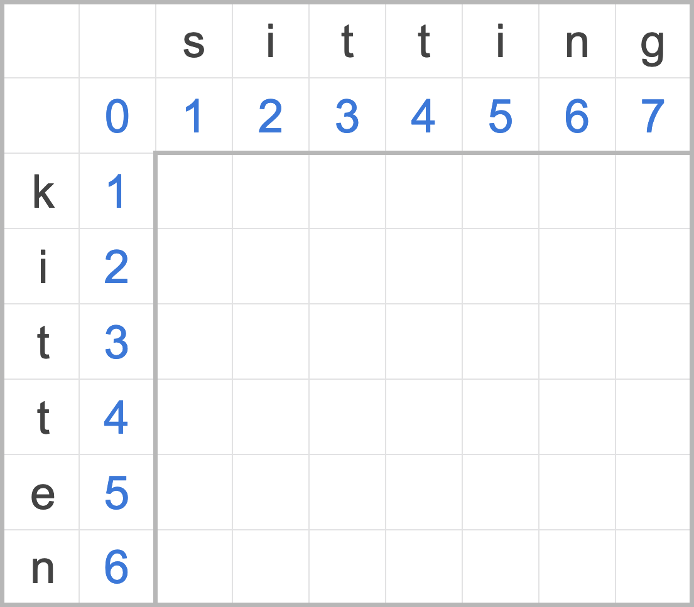
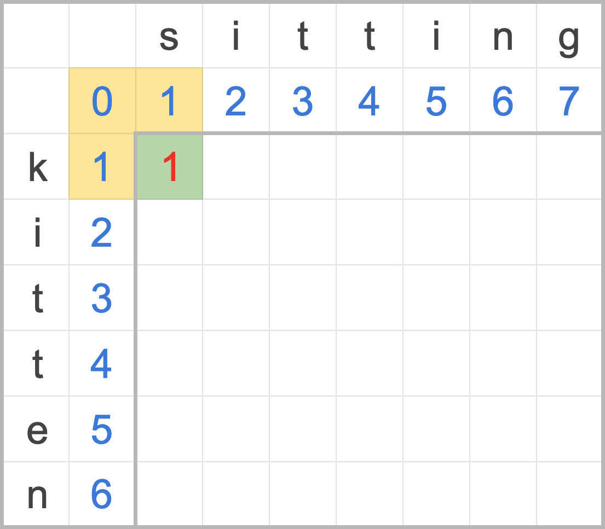
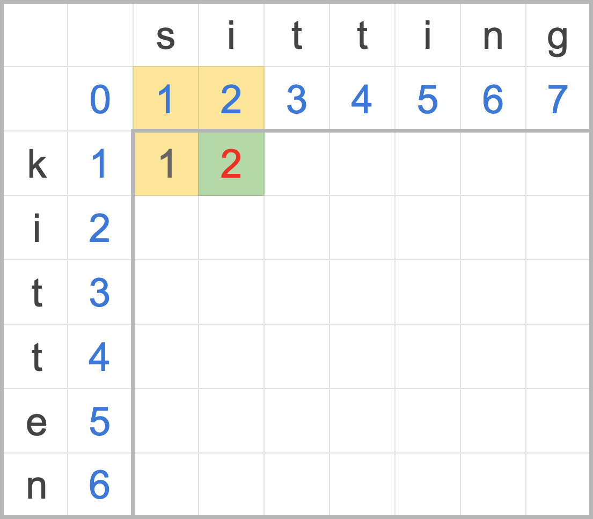
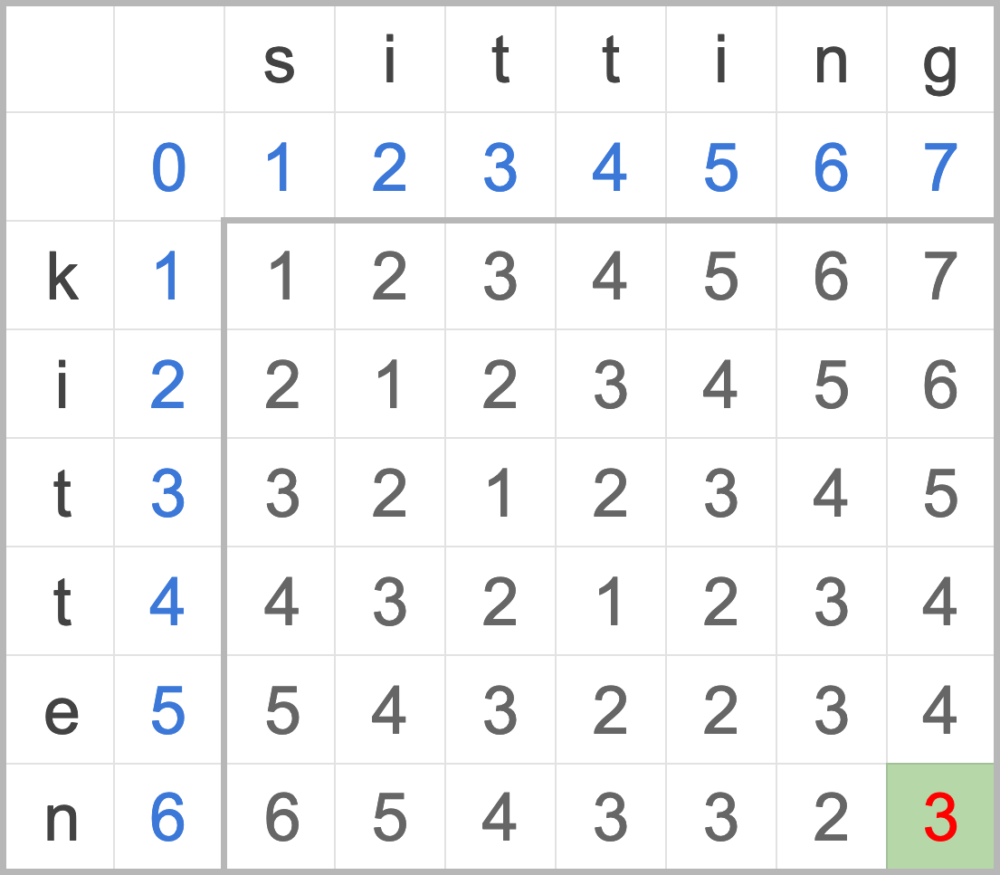
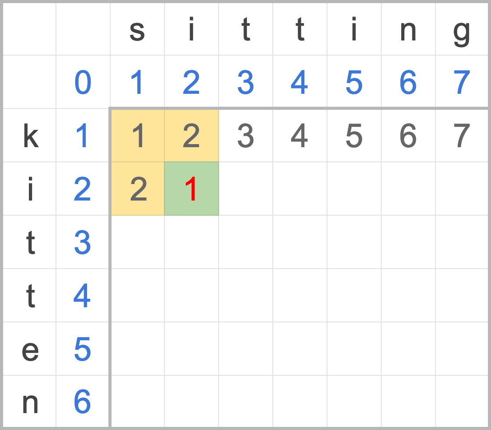
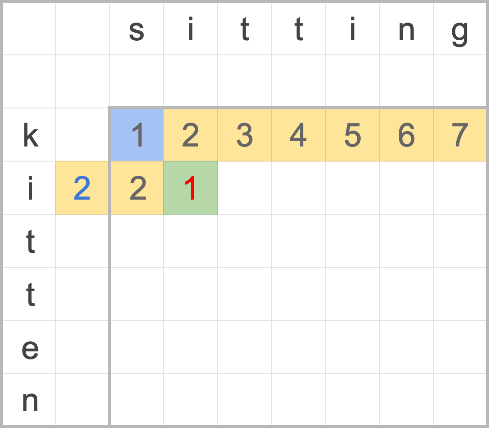
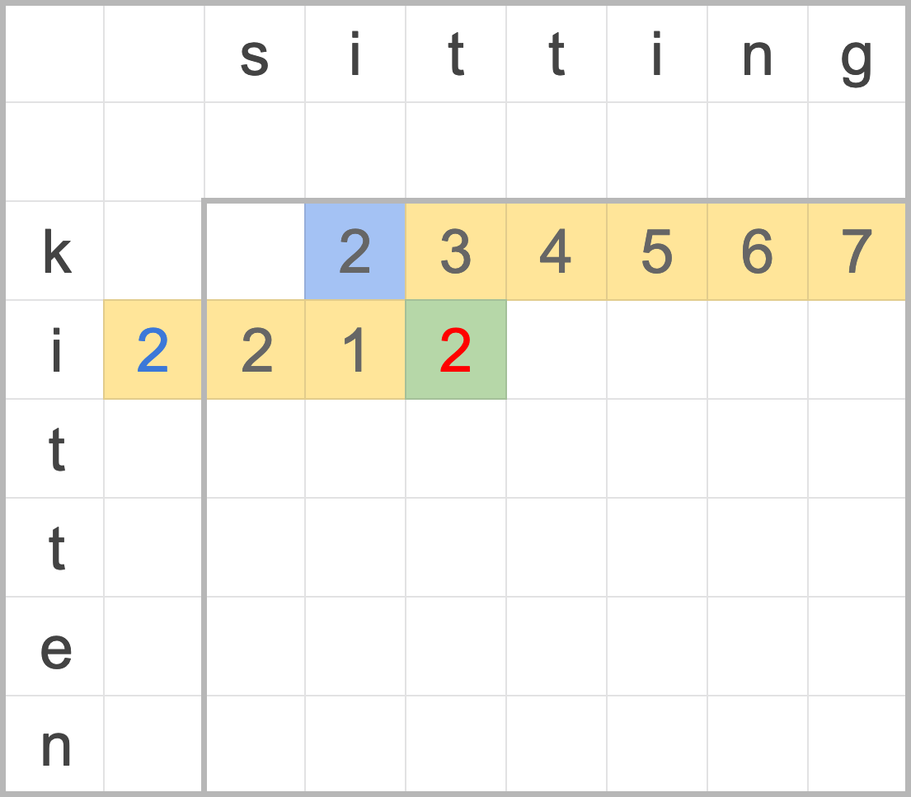

# 萊文斯坦距離 Levenshtein distance

萊文斯坦距離（Levenshtein distance）是一種量化兩字串間差異的演算法，代表從一個字串轉換為另一個字串最少需要多少次編輯操作，這種量化指標的演算法稱為[「編輯距離（Edit distance）」][wiki-edit-distance]，不同的演算法允許的編輯操作不盡相同，萊文斯坦距離允許使用：

- 插入（insertion）
- 刪除（deletion）
- 置換（substitution）

三種編輯操作，通常一般實作上三種操作的權重會相同。

萊文斯坦距離概念易理解，實作簡單，常用在簡易拼字修正與建議，為最具代表性的編輯距離演算法。


> 本次實作的程式碼置於
>
> - [`rust_algorithm_club::levenshtein_distance`][doc-lev-dist]
> - [`rust_algorithm_club::levenshtein_distance_naive`][doc-lev-dist-naive]
>
> API 文件中。

[doc-lev-dist]: /doc/rust_algorithm_club/fn.levenshtein_distance.html
[doc-lev-dist-naive]: /doc/rust_algorithm_club/fn.levenshtein_distance_naive.html

## 概念

### 萊文斯坦的遞迴函數

編輯距離愛拿 kitten 和 sitting 當例子，這兩個單字的編輯距離為 3，可以透過以下步驟，算出 kitten 與 sitting 轉換會經歷三個編輯操作：

1. **s**itting -> **k**itting：置換 /k
2. kitt**i**ng -> kitt**e**ng：置換 i/e
3. kitten**g** -> kitten ~~**g**~~：刪除最末端 g

等等，怎麼知道 3 就是最少編輯操作呢？我們可以經由下列函數計算萊文斯坦距離：

$$
\operatorname{lev} _{a,b}(i,j) =
  \begin{cases}
    \max(i,j)       & \text{if} \min(i,j) = 0, \\\\
    \min{
      \begin{cases}
        \operatorname{lev} _{a,b}(i-1,j) + 1, \\\\
        \operatorname{lev} _{a,b}(i,j-1) + 1, \\\\
        \operatorname{lev} _{a,b}(i-1,j-1) + 1 _{(a _{i} \neq b _{j})}
      \end{cases}
    }               & \text{otherwise.}
  \end{cases}
$$

> $\operatorname{lev}_{a,b}(i,j)$ 代表字串 $a$ 前 $i$ 個字元，與 $b$ 前 $j$ 個字元的萊文斯坦距離。（$i$、$j$ 索引從 1 開始計算）

別怕，這個函數是一個分段函數（piecewise function），由兩個子函數組成，接下來將一一拆解。

首先來看第一個子函數：

$$
\max(i,j) \hspace{10 pt} \text{if} \min(i,j) = 0
$$

根據函數定義，$i$ $j$ 可以視為 $a$ $b$ 前幾個字元的子字串（substring），所以這個子函數白話翻譯是「若有子字串是空字串，則以較長的子字串長度作為編輯距離」。這其實非常直觀，如果有一空字串和另一個非空字串 `abc`，那編輯距離一定是插入三次或刪除三次，也就是該字串長度。這帶出萊文斯坦距離一個很重要的上界：「兩字串的編輯距離至多為較長字串的長度」。

第二個子函數稍微複雜，要再從三個函數中取最小值，但剛剛好，這三個函數分別代表了萊文斯坦距離接受的插入、刪除、置換三種操作：

- $\operatorname{lev} _{a,b}(i-1,j) + 1$：從 a 轉變到 b 要刪除 1 字元。
- $\operatorname{lev} _{a,b}(i,j-1) + 1$：從 a 轉換到 b 要插入 1 字元。
- $\operatorname{lev} _{a,b}(i-1,j-1) + 1 _{(a _{i} \neq b _{j})}$：若 a 等於 b，就不需任何操作，直接一起跳過；反之則置換一次。

這是子函數是遞迴函數，每次都會分出三個子程序計算萊文斯坦距離，空間複雜度直逼 $O(3^{m + n - 1})$，驚人！

> 複雜度的 3 次方會減一是因為只要 m n 其中一個歸零，該路徑就不再遞迴。

### 動態規劃的距離矩陣

由於上述遞迴複雜度過搞，因此處理萊文斯坦距離，通常會選擇由下至上（bottom-up） 的動態規劃（Dynamic programming），利用一個距離矩陣，將兩個字串所有子字串間的萊文斯坦距離累積紀錄起來，省去重複計算的成本。

首先，先將最基礎的 a、b 其一為空字串時的編輯距離寫上去，因為其中一個為空字串，編輯距離必定是隨著另一字串增加，逐一插入字元（最左方的直行）或刪除字元（上方橫列）。

> 註：若插入刪除權重相等，對萊文斯坦來說這兩種操作其實一樣，只是由 a 到 b 或 b 到 a 的差異。



_圖一：空字串與編輯距離_

接下來我們要來算 k 與 s 子字串的編輯距離，按照公式來計算：

1. 紅字上方是執行刪除的累積編輯距離（1），加上刪除操作的成本（1），為 1 + 1 = 2
2. 紅字左方是執行插入的累積編輯距離（1），加上插入操作的成本（1），為 1 + 1 = 2
3. 紅字對角是執行置換的累積編輯距離（1），加上當前 k s 字元不相等的置換成本（1），為 0 + 1 = 1
4. 從刪除、插入、置換的成本中選一個最小值 MIN(2,2,1) 填入矩陣中，完成。



_圖二：子字串 k 與 s 的編輯距離_

我們再來看一組範例，k 與 si 的距離為 2：

1. 紅字上方是執行刪除的累積編輯距離（2），加上刪除操作的成本（1），為 2 + 1 = 3
2. 紅字左方是執行插入的累積編輯距離（1），加上插入操作的成本（1），為 1 + 1 = 2
3. 紅字對角是執行置換的累積編輯距離（1），加上當前 k i 字元不相等的置換成本（1），為 1 + 1 = 2
4. 從刪除、插入、置換的成本中選一個最小值 MIN(3,2,2) 填入矩陣中，完成。



_圖三：子字串 k 與 si 的編輯距離_

最後計算出來整個編輯距離矩陣會長得如下，取矩陣最後一行一列的元素就是累積計算出來的 kitten 與 sitting 的編輯距離。



_圖三：字串 kitten 與 sitting 的完整編輯距離矩陣_

這就是透過動態規劃，將會重複計算的子字串編輯距離紀錄起來，降低原始算式的時空間複雜度，非常簡單暴力的演算法。

## 實作

萊文斯坦距離的函式簽名很簡單，就是吃兩個 string 回傳一個距離：

```rust
pub fn levenshtein_distance(source: &str, target: &str) -> usize
```

首先，先實作第一個子函數

$$
\max(i,j) \hspace{10 pt} \text{if} \min(i,j) = 0
$$

當任一字串長度為 0 時（min(i,j）），編輯距離為另一字串之長度。

```rust
pub fn levenshtein_distance(source: &str, target: &str) -> usize {
    if source.is_empty() {
        return target.len()
    }
    if target.is_empty() {
        return source.len()
    }
    /// ...snip
}
```

### 距離矩陣

接下來實作矩陣的部分，這是純天然沒有特別最佳化的版本，要做三件事：

- 建立一個 a+1 x b+1 的空矩陣，加一是因為要算入 a b 為空字串的狀況。
- 填入 a b 為空字串時第一列與第一行的編輯距離，也就是全插入和全刪除的狀況。
- 按照前一節的概念計算整個距離矩陣。

```rust
    // ...snip
{{#include mod.rs:naive_init}}
```

1. 使用 [`str::chars`][] 計算字串長度，Rust 的 [`str::len`][] 回傳的是位元組（byte）的長度，沒有考慮人類閱讀 UTF-8 編碼字串的視覺字元長度。選用 Chars 可以處理絕大部分常見的 UTF-8 字串問題（支援 CJK）。
2. 使用 `vec!` 巨集建立一個 vector of vector，也就是我們的距離矩陣。
3. 填入第一行和第一列空字串時的狀況，也就是初始化成圖一的情形。

[`str::chars`]: http://doc.rust-lang.org/std/primitive.str.html#method.chars
[`str::len`]: http://doc.rust-lang.org/std/primitive.str.html#method.len

第二步則是撰寫計算距離矩陣編輯操作的邏輯：

```rust
    // ...snip
{{#include mod.rs:naive_calc}}
```

1. 計算插入操作成本，對應萊文斯坦函數中 $\operatorname{lev} _{a,b}(i,j-1) + 1$ 子函數。
2. 計算刪除操作成本，對應萊文斯坦函數中 $\operatorname{lev} _{a,b}(i-1,j) + 1$ 子函數。
3. 計算刪除操作成本，對應萊文斯坦函數中 $\operatorname{lev} _{a,b}(i-1,j-1) + 1 _{(a _{i} \neq b _{j})}$，這裡用了 [`as`][] 運算子，可以在原生型別（primitive type）間互相轉型。
4. 取最小值並紀錄在當前的位置，也就是圖二圖三的綠底紅字。
5. 算完整個距離矩陣後，最後一列最後一行元素就是 a b 兩字串的萊文斯坦距離，你可能好奇，直接呼叫 `unwrap` 沒有處理錯誤合理嗎？其實在「一定不可能出錯」的地方，呼叫 `unwrap` 完全可接受，省去不必要的空值處理。

[`as`]: http://doc.rust-lang.org/std/keyword.as.html

完整程式碼如下：

```rust
{{#include mod.rs:naive}}
```

### 使用一維陣列減少記憶體配置

Rust 的 `Vec` 並非簡單的 array，而是在堆積（heap）上配置記憶體，而每一個 `Vec` 都會帶一個指標和兩個值：指標指向在堆積上的資料，一個值儲存資料當前的長度，一個值儲存容量（圖解請參考 [cheats.rs][cheats-heap-storage]）。所以 `Vec` 會佔三個 usize 的大小，在 64 位元作業系統中就是 24 個位元組。

[cheats-heap-storage]: https://cheats.rs/#general-purpose-heap-storage

但實際上，我們的距離矩陣根本不需要真的矩陣，只需要兩個東西

- 一個一維的 `Vec`
- 一個將二維索引映射到一維空間的函數

再稍微做些小調整就行，如下：

```patch
    // ...snip
    // 1
+    let index = |i, j| i * (target_count + 1) + j;

    // 2
-    let mut distances = vec![vec![0; target_count + 1]; source_count + 1];
+    let mut distances = vec![0; (target_count + 1) * (source_count + 1)];

    for i in 1..=source_count {
    // 3
-        distances[i][0] = i;
+        distances[index(i, 0)] = i;
    }
    // ...change matrix indexing as above
```

1. 二維索引轉換成一維索引的閉包（closure）
2. 原本的 `Vec<Vec<usize>>` 變為 `Vec<usize>` 的一維矩陣，總元素量不變
3. 改寫所有矩陣索引

> 若要更有趣的索引方式，可以實作 [`core::ops::Index`][] trait，這裡就不贅述了。

[`core::ops::Index`]: http://doc.rust-lang.org/core/ops/trait.Index.html

### 拋棄矩陣：降低空間複雜度

回想一下，當我們在計算一個編輯距離時，其實只需要取得三個累積的編輯距離：插入 `matrix[i, j-1]`、刪除 `matrix[i-1, j]`，以及置換 `matrix[i-1, j-1]`。如圖四



_圖四：計算一個編輯距離所需之資料。_

這就表示，根本「**無需儲存完整距離矩陣**」，只需儲存前一列的資訊 + 額外一個變數儲存置換操作的成本就行。我們需要儲存的資訊從 (a + 1) x (b + 1) 大小的矩陣，縮小至 a + 1 或 b + 1 長度的一維陣列。



_圖五：僅使用一維陣列儲存前一列的資訊。黃色為儲存的陣列，藍色為額外儲存的置換的累積編輯距離_

這個最佳化的程式碼，比起矩陣解法又更簡短了，以下一一說明：

```rust
{{#include mod.rs:lev_dist}}
```

1. 和前一段相同，計算空字串的距離。
2. 不需要初始化 a x b 個元素，只需要初始化最多一列的陣列。這裡利用 `0..=count` 這種 [`core::ops::RangeInclusive`][] 的寫法，直接產出含有 0 到字串長度的 `Vec<usize>`，這段等同 naive 作法中填入第一列全插入的編輯距離，但省下自己手寫一個迴圈。
3. 將索引 i 作為初始化的刪除編輯距離，等同於 naive 作法中填入第一行全刪除的編輯距離，但尚未用到的距離就跟著索引 i 遞增，不需事先計算了。這個 `sub` 也等同於置換的累積編輯距離。
4. 置換的累積編輯距離 + 1 就會等於插入的累積編輯距離。
5. 前面步驟配置好陣列後，就可以來計算函數：
    - 插入：索引 j 的元素就是插入的累積編輯距離（圖五紅字左方）。
    - 刪除：索引 j + 1 的元素就是刪除的累積編輯距離（圖五紅字上方）。
    - 置換：`sub` 變數儲存的就是置換的累積編輯距離（圖五藍色）。
6. 更新 `sub` 置換的累積編輯距離，也就是這一輪的刪除的累積編輯距離（圖六藍色），以供內層迴圈下個 target char 疊代使用。
7. 將計算所得的編輯距離填入陣列中（圖五紅字/圖六紅字左方），以供外層迴圈計算下一列疊代時使用。
8. 計算完成，取最後一個元素就是兩字串的編輯距離了。

[`core::ops::RangeInclusive`]: http://doc.rust-lang.org/core/ops/struct.RangeInclusive.html



_圖六：使用一維陣列疊代計算，藍色為額外儲存的置換的累積編輯距離_

## 效能

|                     | Complexity     |
| ------------------- | -------------- |
| Worst               | $O(mn)$        |
| Worst space         | $O(\min(m,n))$ |
| Worst space (naive) | $O(mn)$        |

> $m$：字串 a 的長度  
> $n$：字串 b 的長度

顯而易見，萊文斯坦距離最差時間複雜度就是內外兩個迴圈疊代兩個字串的所有字元。而空間複雜度原本是 $m \cdot n$ 的矩陣，在最佳化動態規劃後，只需兩字串長度 m 或 n 中最小值長度陣列作為儲存空間。

## 參考資料

- [Wiki: Levenshtein distance](https://en.wikipedia.org/wiki/Levenshtein_distance)
- [Levenshtein distance in Cargo][cargo-lev-distance]
- [Levenshtein distance in Rust Std (1.0.0-alpha)][rust-std-lev-distance]
- [Ilia Schelokov: Optimizing loop heavy Rust code](https://thaumant.me/optimizing-loop-heavy-rust/)
- [Turnerj: Levenshtein Distance (Part 2: Gotta Go Fast)](https://turnerj.com/blog/levenshtein-distance-part-2-gotta-go-fast)

[wiki-edit-distance]: https://en.wikipedia.org/wiki/Edit_distance
[rust-std-lev-distance]: https://github.com/rust-lang/rust/commit/4908017d59da8694b9ceaf743baf1163c1e19086#diff-4bb86c087880e113f4d68d0b846eff3f5078612f8c08915a2b58162c332fb7dc
[cargo-lev-distance]: https://github.com/rust-lang/cargo/blob/7d7fe6797ad07f313706380d251796702272b150/src/cargo/util/lev_distance.rs
